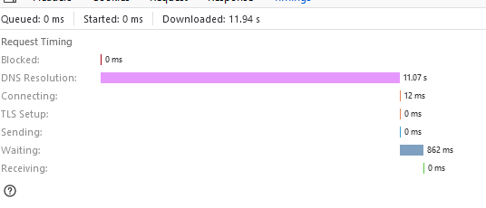

# Fixing Route Table for WSL2

This guide applies to Cisco AnyConnect in environments where it has been configured to block split-tunneling.

## Step #1 - WSL2 Internet Access

First you need to ensure your WSL2 distributions can access the internet. Before connecting to the VPN your routes for
WSL2 will look something like (using the `Get-NetAdapter` command in powershell):

```
ifIndex DestinationPrefix                              NextHop                                  RouteMetric ifMetric PolicyStore
------- -----------------                              -------                                  ----------- -------- -----------
23      172.24.31.255/32                               0.0.0.0                                          256 5000     ActiveStore
23      172.24.16.1/32                                 0.0.0.0                                          256 5000     ActiveStore
23      172.24.16.0/20                                 0.0.0.0                                          256 5000     ActiveStore
```

But when you connect to the VPN, AnyConnect adds a non-functional route with a lower metric:

```
23      172.24.31.255/32                               0.0.0.0                                          256 5000     ActiveStore
23      172.24.16.1/32                                 0.0.0.0                                          256 5000     ActiveStore
4       172.24.16.0/20                                 10.74.112.1                                        1 1        ActiveStore
23      172.24.16.0/20                                 0.0.0.0                                          256 5000     ActiveStore
```

Unfortunately we cannot remove or modify this route because it will be automatically
[replaced by AnyConnect](https://community.cisco.com/t5/vpn/enforcing-the-split-tunnel-only-access/m-p/4390557/highlight/true#M278089).
However, Windows determines the best route by the lowest 
[sum of interface metric + route metric](https://docs.microsoft.com/en-us/windows-server/networking/technologies/network-subsystem/net-sub-interface-metric). 
What we can do is increase the AnyConnect interface metric:

```powershell
Get-NetAdapter | Where-Object {$_.InterfaceDescription -Match "Cisco AnyConnect"} | Set-NetIPInterface -InterfaceMetric 6000
```

Now the route table will allow WSL2's NAT connection to the Internet, because 5256 is a lower metric than 6001:

```
23      172.24.31.255/32                               0.0.0.0                                          256 5000     ActiveStore
23      172.24.16.1/32                                 0.0.0.0                                          256 5000     ActiveStore
4       172.24.16.0/20                                 10.74.112.1                                        1 6000     ActiveStore
23      172.24.16.0/20                                 0.0.0.0                                          256 5000     ActiveStore
```

## Step #2 - Automation

The AnyConnect metric will unfortunately be reset every time the VPN is started, so we need to automate this fix
with task scheduler. Save the above [powershell command](./setCiscoVpnMetric.ps1?raw=true) as `setCiscoVpnMetric.ps1`

Open task scheduler and click "Create task":

- Name: "Update AnyConnect Adapter Interface Metric for WSL2"
- Security options: Check "Run with highest privileges"
- Triggers:
  - On an Event, Log: Cisco AnyConnect Secure Mobility Client, Source: acvpnagent, Event ID: 2039
  - On an Event, Log: Cisco AnyConnect Secure Mobility Client, Source: acvpnagent, Event ID: 2041
- Actions: Start a program, Program/script: `powershell.exe`, 
  Add arguments: `-WindowStyle Hidden -NonInteractive -ExecutionPolicy Bypass -File %HOMEPATH%\Documents\setCiscoVpnMetric.ps1`
- Conditions: Uncheck "Start the task only if the computer is on AC power"

## Step #3 - Working Windows DNS

The above fix then leads to a problem for the Windows host - the interface metric is also used by Windows to determine 
the ordering of DNS servers. As a result the VPN adapter now has the lowest priority DNS:

```powershell
PS C:\Users\jdhalsey> Get-NetIPInterface | Where-Object {$_.ConnectionState -eq 'Connected'} | Sort-Object -Property InterfaceMetric

ifIndex InterfaceAlias                  AddressFamily NlMtu(Bytes) InterfaceMetric Dhcp     ConnectionState PolicyStore
------- --------------                  ------------- ------------ --------------- ----     --------------- -----------
23      vEthernet (WSL)                 IPv4                  1500              15 Disabled Connected       ActiveStore
23      vEthernet (WSL)                 IPv6                  1500              15 Enabled  Connected       ActiveStore
13      Ethernet                        IPv4                  1500              25 Enabled  Connected       ActiveStore
13      Ethernet                        IPv6                  1492              25 Enabled  Connected       ActiveStore
17      Wi-Fi                           IPv6                  1492              50 Enabled  Connected       ActiveStore
17      Wi-Fi                           IPv4                  1500              50 Enabled  Connected       ActiveStore
1       Loopback Pseudo-Interface 1     IPv4            4294967295              75 Disabled Connected       ActiveStore
1       Loopback Pseudo-Interface 1     IPv6            4294967295              75 Disabled Connected       ActiveStore
4       Ethernet 2                      IPv6                  1300            6000 Enabled  Connected       ActiveStore
4       Ethernet 2                      IPv4                  1300            6000 Disabled Connected       ActiveStore
```

Windows will try the IPv6 and IPv4 DNS servers on both your Ethernet and Wi-Fi first, even though they are unreachable
due to the VPN. Depending on how many servers are configured this can add long delays to DNS resolution, for example:



You can verify this by running `nslookup.exe google.com`, you should see that it attempts to use the first DNS server of 
whichever interface has the lowest metric, in this case your Ethernet adapter, and therefore will fail when connected
to the AnyConnect VPN.

You therefore need to update the interface metrics on your Ethernet and Wi-Fi adapters to be greater than the VPN,
for both IPv4 and IPv6. You can use:

```powershell
Set-NetIPInterface -InterfaceAlias "Ethernet" -InterfaceMetric 6025
Set-NetIPInterface -InterfaceAlias "Wi-Fi" -InterfaceMetric 6050
```

(Or alternatively: Control Panel -> Network and Sharing Center -> Change adapter settings -> Ethernet Properties -> 
Internet Protocol Version 4/6 -> Advanced -> Interface Metric)

The interface ordering should now look like:

```powershell
PS C:\Users\jdhalsey> Get-NetIPInterface | Where-Object {$_.ConnectionState -eq 'Connected'} | Sort-Object -Property InterfaceMetric

ifIndex InterfaceAlias                  AddressFamily NlMtu(Bytes) InterfaceMetric Dhcp     ConnectionState PolicyStore
------- --------------                  ------------- ------------ --------------- ----     --------------- -----------
23      vEthernet (WSL)                 IPv6                  1500              15 Enabled  Connected       ActiveStore
23      vEthernet (WSL)                 IPv4                  1500              15 Disabled Connected       ActiveStore
1       Loopback Pseudo-Interface 1     IPv4            4294967295              75 Disabled Connected       ActiveStore
1       Loopback Pseudo-Interface 1     IPv6            4294967295              75 Disabled Connected       ActiveStore
4       Ethernet 2                      IPv4                  1300            6000 Disabled Connected       ActiveStore
4       Ethernet 2                      IPv6                  1300            6000 Enabled  Connected       ActiveStore
13      Ethernet                        IPv6                  1492            6025 Enabled  Connected       ActiveStore
13      Ethernet                        IPv4                  1500            6025 Enabled  Connected       ActiveStore
17      Wi-Fi                           IPv6                  1492            6050 Enabled  Connected       ActiveStore
17      Wi-Fi                           IPv4                  1500            6050 Enabled  Connected       ActiveStore
```

You can verify this is working by running `nslookup.exe google.com`, you should see a successful request to the address
of the VPN DNS server.

## WSL2 <-> Host Communication

In step #1 we modified the route metrics such that WSL should in theory now be reachable:

```powershell
PS C:\Users\jdhalsey> Find-NetRoute -RemoteIPAddress "172.24.18.66" | select InterfaceAlias

InterfaceAlias
--------------
vEthernet (WSL)
vEthernet (WSL)
```

Yet if we launch an HTTP server in WSl2:

```bash
python3 -m http.server 8000
```

And attempt to connect to it whilst AnyConnect is running, under certain AnyConnect setups this may fail:

```powershell
PS C:\Users\jdhalsey> curl.exe http://172.24.18.66:8000
curl: (7) Failed to connect to 172.24.18.66 port 8000 after 0 ms: Bad access
```

The reason for this is that AnyConnect is blocking communication at the firewall level, unfortunately this is
implemented using a Windows Filtering Platform kernel level driver, so it cannot easily be disabled.

Fortunately if you are on [WSL 18970](https://docs.microsoft.com/en-us/windows/wsl/release-notes#build-18970) or newer
you can use the localhost relay to work around this:

```powershell
PS C:\Users\jdhalsey> curl.exe http://localhost:8000
<!DOCTYPE HTML PUBLIC "-//W3C//DTD HTML 4.01//EN" "http://www.w3.org/TR/html4/strict.dtd">
```

Your VPN administrator should however be able to fully fix this using the AnyConnect's `BypassVirtualSubnetsOnlyV4`
options, see [Connectivity Issues with VM-based Subsystems](https://www.cisco.com/c/en/us/td/docs/security/vpn_client/anyconnect/anyconnect410/administration/guide/b-anyconnect-admin-guide-4-10/troubleshoot-anyconnect.html#Cisco_Task_in_List_GUI.dita_3a9a8101-f034-4e9b-b24a-486ee47b5e9f).
